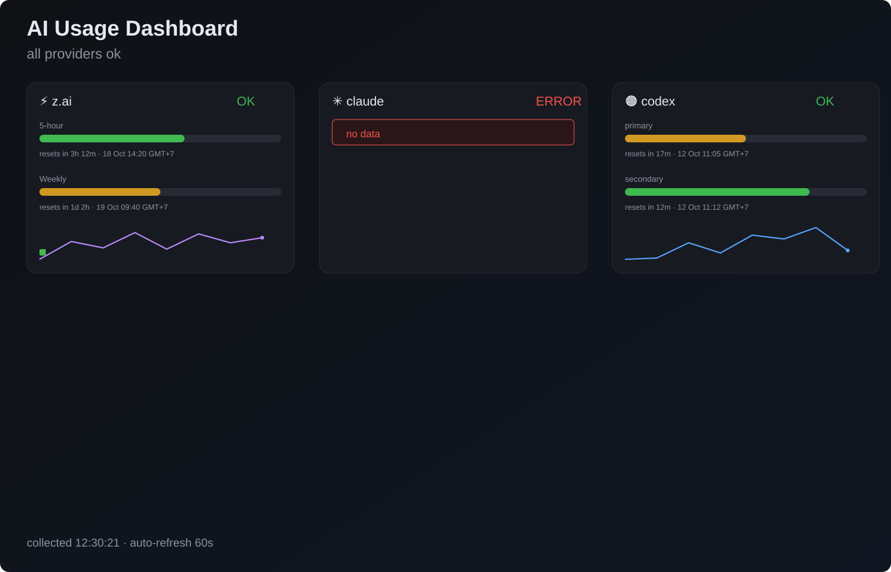

# AI Usage Dashboard (`aidash`)

An on-machine dashboard that pulls usage/credit usage data from multiple AI providers and visualizes it in one web page.

- Backend: `Rust + Axum`
- Frontend: `index.html` embedded in binary via `include_str!`
- Storage: in-memory snapshot buffer (no database)
- Providers: **z.ai**, **OpenCode Go**, **Claude**, **Codex**, **Antigravity**

---

## Features

- Single-page dashboard at `/`
- Provider usage graphs and status cards
- API endpoints:
  - `GET /data.json` for latest snapshot
  - `GET /history.json` for historical snapshots used by sparkline charts
- First snapshot is collected on startup, then refreshed by a background loop
- `tmux` control script (`ctl.sh`) for convenient process control

### OpenCode Go

- Reads a Bearer API key from a plain text file (default `$HOME/aidash/opencode-go.key`; override with `OPENCODE_GO_KEY_FILE`)
- Queries `https://opencode.ai/zen/go/v1/usage` and reports all three usage windows: **5-hour** (rolling), **Weekly**, **Monthly** with reset countdowns
- Passive read-only usage endpoint — polling does not consume quota
- Plan badge shows `Go`

### Antigravity (Google)

- Reads the local OAuth token from `~/.gemini/antigravity-cli/antigravity-oauth-token` (created by the `agy` CLI / Antigravity IDE login)
- Queries the Gemini Cloud Code internal API (`cloudcode-pa.googleapis.com`) for per-model quota
- Models sharing a quota pool (identical `remainingFraction`) collapse into one row (e.g. *Gemini pool ×16*); click to expand the model list
- A pool that hit its 5-hour limit shows as **100% — limit hit** with reset countdown
- Models with no quota data yet are grouped into a grey *no quota data* row
- Plan/tier badge (e.g. `g1-pro-tier`) via `loadCodeAssist`
- Auto-refreshes the OAuth token on 401 (read-only; never writes back to the token file)
- Override token path with `ANTIGRAVITY_TOKEN_FILE`

## UI Page



This is the live dashboard page rendered at `/`.

- `index` serves this page directly from embedded HTML
- cards refresh automatically and poll `/data.json`
- history chart uses a gradient filled area sparkline (instead of line-only) from `/history.json`

Recent UI refresh details:

- sparkline now renders filled gradient area to emphasize trend shape
- each series has a stronger stroke and explicit baseline for better readability
- single-point history uses a minimal filled baseline shape for consistent appearance

To open the actual page:

```bash
./target/release/aidash
# open http://127.0.0.1:8000
```

To view static structure only (no backend needed), open [index.html](/home/dump/aidash/index.html) directly.

---

## Project structure

- `src/main.rs`: Axum server + provider collectors
- `index.html`: dashboard UI
- `ctl.sh`: control helper (`start|stop|restart|status|attach|logs`)
- `Cargo.toml`: Rust dependencies
- `.gitignore`: excludes build output and key files

---

## Build

```bash
cargo build --release
```

Binary output: `target/release/aidash`

---

## Run directly

```bash
export AIDASH_LISTEN=0.0.0.0:8000
export AIDASH_INTERVAL=300
./target/release/aidash
```

Defaults in code:

- `AIDASH_LISTEN`: `0.0.0.0:8000`
- `AIDASH_INTERVAL`: `300` (seconds)
- `ZAI_KEY_FILE`: `$HOME/aidash/zai.key`
- `OPENCODE_GO_KEY_FILE`: `$HOME/aidash/opencode-go.key`
- `CLAUDE_CRED_FILE`: `$HOME/.claude/.credentials.json`
- `CODEX_AUTH_FILE`: `$HOME/.codex/auth.json`
- `ANTIGRAVITY_TOKEN_FILE`: `$HOME/.gemini/antigravity-cli/antigravity-oauth-token`

---

## Manage with `ctl.sh`

```bash
./ctl.sh start
./ctl.sh status
./ctl.sh logs
./ctl.sh stop
```

Log file: `aidash.log` (created while running via script)

Default script overrides:

- `AIDASH_INTERVAL` = `120`
- `AIDASH_LISTEN` = `0.0.0.0:8000`

Example with custom values:

```bash
AIDASH_INTERVAL=120 AIDASH_LISTEN=127.0.0.1:9000 ./ctl.sh start
```

---

## API examples

### `GET /data.json`

```json
{
  "collected": "2026-08-06T00:00:00Z",
  "ts": 1754448000,
  "any_error": false,
  "providers": [
    {
      "provider": "claude",
      "status": "ok",
      "plan": null,
      "limits": [
        {
          "label": "5-hour",
          "used_percent": 42.3,
          "remaining_percent": 57.7,
          "resets_at": 1754486400
        }
      ]
    },
    {
      "provider": "antigravity",
      "status": "ok",
      "plan": "g1-pro-tier",
      "limits": [
        {
          "label": "Gemini pool ×16",
          "models": ["gemini-3.6-flash-medium", "gemini-3.1-pro-high", "..."],
          "used_percent": 4.5,
          "remaining_percent": 95.5,
          "resets_at": 1786886264
        },
        {
          "label": "Claude + GPT pool ×3 — limit hit",
          "models": ["claude-opus-4-6-thinking", "claude-sonnet-4-6", "gpt-oss-120b-medium"],
          "used_percent": 100.0,
          "remaining_percent": 0.0,
          "resets_at": 1786886250
        }
      ]
    }
  ]
}
```

### `GET /history.json`

Array of snapshots, each containing trimmed provider usage points for sparkline rendering.

---

## Required credentials

- z.ai: token text file (path from `ZAI_KEY_FILE`)
- OpenCode Go: API key text file (path from `OPENCODE_GO_KEY_FILE`; from `opencode auth login -p opencode-go` or the OpenCode Go console)
- Claude: JSON file with `claudeAiOauth.accessToken` under the `CLAUDE_CRED_FILE`
- Codex: JSON file with:
  - `tokens.access_token`
  - `tokens.refresh_token` (used when access token expires, unless `CODEX_DISABLE_REFRESH=1`)
- Antigravity: JSON file with `token.access_token` / `token.refresh_token` (path from `ANTIGRAVITY_TOKEN_FILE`; created by `agy` login)

Never commit these credential files.

---

## Notes

- Parsing depends on current provider API response shape; schema changes may require code updates.
- Keep credentials on trusted machines only.
- Frontend refreshes data every 60 seconds by default.

---

## License / scope

This is a personal dashboard project intended for local use.
